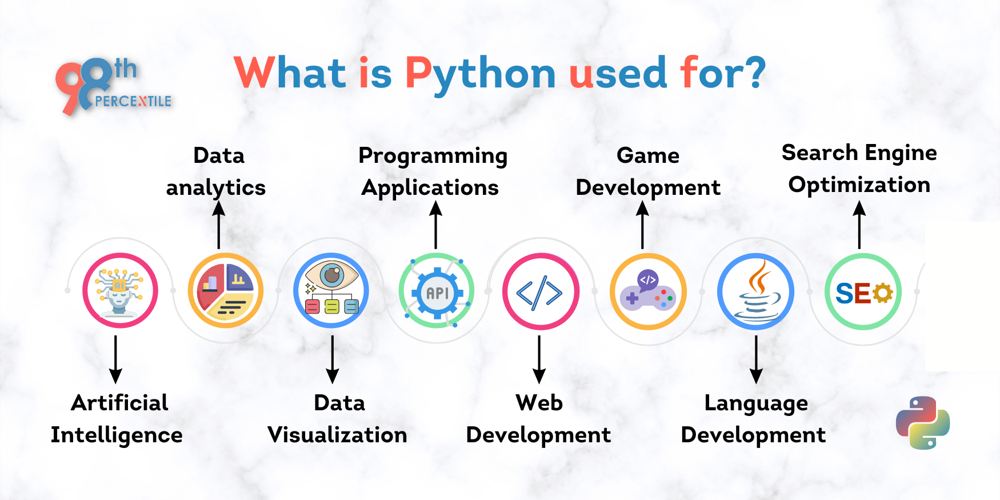
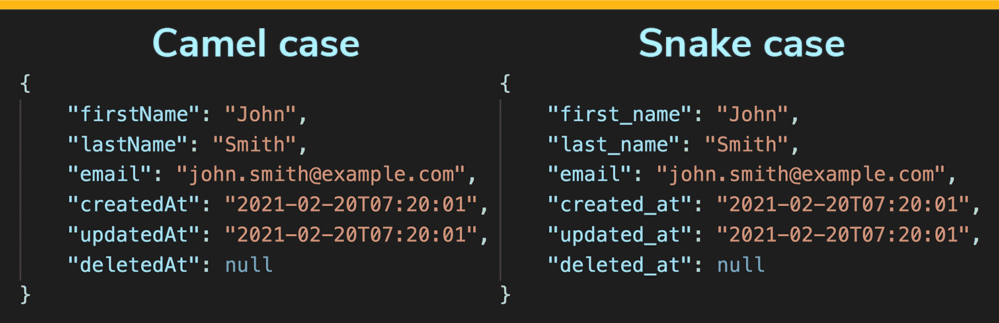
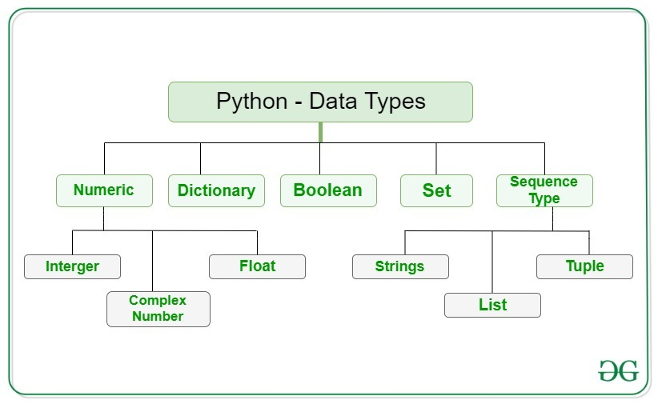

# Лекция 1: Введение в Python

### 1. Почему Python?
#### Python - кроссплатформенный язык программирования

Python — это кроссплатформенный язык программирования, что означает, что он работает на различных платформах, таких как **Windows**, **macOS**, **Linux** и даже может быть портирован на виртуальные машины **Java** и **.NET**.

#### Поддержка различных парадигм

Python поддерживает несколько стилей программирования:
- **Процедурное программирование**
- **Объектно-ориентированное программирование**
- **Функциональное программирование**

#### Основные характеристики языка

- **Простота синтаксиса**: Python использует читабельный и интуитивно понятный синтаксис, что делает его идеальным для начинающих.
- **Широкое применение**: Python используют в науке о данных, веб-разработке, машинном обучении, автоматизации и других областях.
- **Большая поддержка и сообщество**: огромная библиотека модулей и активное сообщество поддержки.


#### Основные области применения Python

- **Веб-разработка**: можно использовать для создания серверных веб-приложений, подключения к базам данных и работы с файлами данных.
- **Разработка ПО**: подходит для быстрого создания прототипов и разработки готового к производству ПО.
- **Математика и наука**: Python отлично подходит для обработки больших данных и выполнения сложных математических расчетов.
- **Системные скрипты**: используется для написания скриптов для автоматизации рабочих процессов в операционных системах.



#### Примеры крупных проектов на Python

Python использовался при создании таких проектов, как:
- **Wikipedia**
- **Google** (где работал Гвидо ван Россум, создатель Python)
- **Yahoo!**, **CERN**, **NASA**
- Популярные сервисы **PayPal**, **Instagram**, **Spotify**
---
### 2. Краткая история языка программирования Python

1. **1980-е годы**: Идея создания Python появилась в голове Гвидо ван Россума, который работал в Нидерландах в Центре математики и информатики (CWI). Он искал язык, который был бы простым и удобным для написания кода, но при этом мощным и гибким.

2. **1991 год**: Гвидо ван Россум выпустил первую версию Python (0.9.0). Язык был задуман как интерпретируемый и с поддержкой объектов. Он сочетал простоту синтаксиса с мощными возможностями для разработки.

3. **1994 год**: Выход Python 1.0. Язык начал набирать популярность благодаря простоте и читаемости кода.

4. **2000 год**: Python 2.0 — новая версия с улучшенной поддержкой юнит-тестирования и улучшенной системой исключений. На протяжении нескольких лет Python 2 оставался основной версией языка.

5. **2008 год**: Вышла версия Python 3.0. Она привнесла множество улучшений, включая поддержку Unicode, улучшение синтаксиса и стандартных библиотек. Однако она была несовместима с Python 2, что вызвало переходный период, в течение которого обе версии использовались параллельно.

6. **2020-е годы**: Python 3 стал доминирующей версией. Он используется в самых разных областях, от веб-разработки и научных вычислений до машинного обучения и искусственного интеллекта. Python продолжает развиваться и поддерживать высокую популярность благодаря простоте в обучении и мощным библиотекам.

Таким образом, Python прошел долгий путь от языка, созданного для внутренних нужд, до одного из самых популярных языков программирования в мире.

---
### 3. Интерпретируемые языки программирования: что это значит?

Когда мы говорим, что Python — это интерпретируемый язык, это означает,
что код на Python выполняется не через предварительную компиляцию в машинный код,
как это происходит в языках типа C или C++, а непосредственно интерпретируется в
процессе выполнения. Рассмотрим, как это работает.

1. **Исходный код**: Вы пишете программу на Python в текстовом файле с расширением `.py`.
2. **Запуск интерпретатора**: Когда вы запускаете программу, интерпретатор Python читает и выполняет исходный код построчно.
3. **Промежуточный байт-код**: В процессе выполнения код Python сначала преобразуется в байт-код — специальное промежуточное представление, которое является более компактным и может быть исполнено виртуальной машиной Python (PVM).
4. **Выполнение**: Виртуальная машина Python (PVM) выполняет байт-код, взаимодействуя с операционной системой и ресурсами компьютера.

#### Как это отличается от компилируемых языков?

В компилируемых языках, например, в C или C++, исходный код сначала компилируется в исполнимый файл, который затем запускается. В отличие от этого, интерпретируемые языки не требуют этого промежуточного шага: программа выполняется сразу, по мере чтения кода интерпретатором.

#### Преимущества интерпретируемых языков:

- **Простота отладки**: Ошибки проще отслеживать, потому что код выполняется построчно, и можно сразу увидеть, где произошла ошибка.
- **Гибкость**: Изменения в коде можно внедрять без необходимости компиляции, что делает процесс разработки более гибким.
- **Портируемость**: Код Python может выполняться на различных операционных системах без необходимости перекомпиляции, что делает его более переносимым.

#### Недостатки интерпретируемых языков:

- **Производительность**: Из-за того, что код интерпретируется построчно в реальном времени, интерпретируемые языки часто медленнее компилируемых, поскольку весь процесс выполнения проходит через интерпретатор.

Таким образом, интерпретируемые языки предоставляют гибкость и удобство разработки, но могут иметь ограничение по скорости выполнения, что важно учитывать при выборе языка для решения конкретных задач.

---
### 4. Установка и настройка

1. **Скачивание Python**
   - Откройте официальный сайт Python: [https://www.python.org/](https://www.python.org/).
   - На главной странице выберите раздел "Downloads" и найдите кнопку "Download Python X.X.X" (где X.X.X – номер последней стабильной версии, например, 3.10.5).
   - Выберите версию для вашей операционной системы (Windows, macOS или Linux):
     - **Windows**: На странице загрузок выберите установщик для Windows (`Windows Installer`) и скачайте файл.
     - **macOS**: Выберите версию для macOS и скачайте `.pkg` файл.
     - **Linux**: Python обычно предустановлен на Linux. Если нет, вы можете использовать команду `sudo apt install python3` для Ubuntu или `sudo dnf install python3` для Fedora.

2. **Установка Python на Windows**
   - Откройте скачанный установочный файл (.exe).
   - В **первом окне установки** отметьте галочку "Add Python to PATH". Это очень важно: добавление Python в PATH позволяет запускать Python из командной строки.
   - Нажмите "Install Now" и дождитесь окончания установки.

3. **Установка Python на macOS**
   - Запустите скачанный файл (.pkg) и следуйте указаниям мастера установки.
   - Обычно на macOS Python добавляется в PATH автоматически.

4. **Проверка установки Python**
   После завершения установки откройте командную строку:
   - **На Windows**: откройте "Командную строку" (или "PowerShell").
   - **На macOS и Linux**: откройте "Терминал".

   В командной строке введите:
   ```bash
   python --version
   ```
   или, если это не сработало, попробуйте:
   ```bash
   python3 --version
   ```
   Вы должны увидеть версию Python, например, `Python 3.10.5`. Это подтверждает, что Python установлен и готов к использованию.

5. **Установка IDE или редактора кода**
   Для удобства работы с Python выберите и установите подходящий редактор:
   - **VS Code**: Легкий, бесплатный редактор с поддержкой плагинов для Python. Загрузите его с [https://code.visualstudio.com/](https://code.visualstudio.com/).
   - **PyCharm**: Полнофункциональная IDE для Python с функциями автодополнения, отладки и удобного интерфейса. Доступен бесплатный Community Edition: [https://www.jetbrains.com/pycharm/download/](https://www.jetbrains.com/pycharm/download/).\
   
#### [Альтернатива](https://jupyter.org)
6. **Проверка работы Python через IDE**
   - Откройте вашу IDE и создайте новый Python-файл (например, `hello.py`).
   - Напишите простой код, чтобы убедиться, что всё работает:
```python
print("Hello, World!")
```
   - Запустите скрипт (обычно клавиша `F5` или специальная кнопка запуска), и убедитесь, что в терминале выводится текст `Hello, World!`.

Теперь у вас установлен Python, и вы можете начать изучение и написание кода!
**Запуск кода**:
- В терминале: используйте команду `python` или `python3` в зависимости от версии.
- Через IDE (например, PyCharm, VS Code, Jupyter Notebook).

---
### 5. Введение в стили написания идентификаторов
Стили написания идентификаторов — это соглашения, которые помогают сделать код более читаемым и структурированным. Самые популярные из них: **CamelCase** и **snake_case**. Они используются для именования переменных, функций, классов и помогают легко различать части кода по их назначению.


---
### 6. Отступы в Python

Python использует **отступы** для определения структуры кода. В отличие от многих других языков, где блоки кода заключаются в фигурные скобки `{}`, Python определяет блоки по уровню отступов, что делает код более читаемым. 

#### Основные правила:

- **Размер отступа**: стандартный размер отступа составляет **4 пробела**, но важно быть последовательным. Использование табуляций (`\t`) вместо пробелов может вызвать ошибки.
- **Структурирование блоков**: все строки в одном блоке должны иметь одинаковый уровень отступа. Нарушение этого правила приведет к ошибке `IndentationError`.
- **Циклы, условия, функции**: все тела функций, циклов и условий должны быть на один уровень отступа правее, чем сама конструкция.

**Пример:**

```python
def my_function():
    if True:
        print("Внутри условия")  # 4 пробела перед этой строкой
    for i in range(3):
        print(i)  # тоже 4 пробела
```

Последовательное использование отступов улучшает читаемость кода и является важной частью стиля программирования в Python.

---
### 7. Комментарии в Python

Комментарии в Python используются для того, чтобы пояснить код, улучшить его читаемость или временно отключить определенные строки. Они не выполняются интерпретатором и помогают разработчикам лучше понимать логику и функциональность программы.

#### Однострочные комментарии

Для создания однострочного комментария в Python используется символ `#`. Все, что написано после него на строке, будет проигнорировано интерпретатором.

```python
# Это однострочный комментарий
print("Hello, World!")  # Комментарий после кода
```

#### Многострочные комментарии

В Python нет специального синтаксиса для многострочных комментариев, но для этого часто используют несколько строк с `#`.

```python
# Это первая строка комментария
# Это вторая строка комментария
# Это третья строка комментария
```

Также многострочные строки в кавычках (`''' ... '''` или `""" ... """`) могут использоваться для многострочных комментариев. Обычно они применяются в качестве **docstring** — строк документации.

```python
"""
Это многострочный комментарий,
который может использоваться в качестве docstring.
"""
def my_function():
    """Эта строка является docstring и описывает функцию."""
    pass
```

#### Основные принципы использования комментариев

- **Будьте краткими и точными**: комментарии должны пояснять суть кода, а не дублировать его.
- **Объясняйте сложную логику**: используйте комментарии там, где код может быть труден для понимания.
- **Не переусердствуйте**: не комментируйте очевидные действия, чтобы код оставался чистым.

Комментарии делают код понятнее и помогают другим разработчикам быстрее разобраться в вашей логике.

---
### 8. Переменные
- Переменные являются **контейнерами** для хранения значений
- В отличие от других языков программирования, в Python нет ключегого слова для объявления переменной
- В Python для создания переменной просто присвойте значение:
```python
# Переменные типа «string» определяются при помощи кавычек
nmbr1, name = 77.5, "Amber"
print(nmbr1) #77.5
print(name) #"Amber"

# Или же можно присвоить одно и то же значение нескольким переменным в одной строке
nmbr1 = nmbr2 = 77.5
print(nmbr1) #77.5
print(nmbr2) #77.5
```

- Переменные не нужно объявлять какого-то конкретного типа - они могут даже изменить тип после того, как уже были установлены
- Интерпретатор производит парсинг значения и определяет какого типа является переменная, которой было присвоенно данное значение
- Для присвоения значения переменной используется оператор «присвоения» - символ «равно»\
*Названия переменных чувствительны к регистру(age и Age - разные переменные) и не должны начинаться с цифры(либо с буквы, либо с символа подчеркивания), но содержать внутри себя цифры может.*

---

### 9.  Основные типы данных в Python
Python — язык с **динамической типизацией**, где тип данных переменной определяется автоматически при присвоении значения. Python обладает как основными (базовыми) типами данных, так и более сложными структурами данных, которые позволяют эффективно работать с различными наборами данных. 

## Часть 1

1. **None**  
   - **Описание**: Экземпляр типа объекта `NoneType`, который представляет собой особую переменную, не имеющую целевого значения.
   - **Пример**:
```python
     x = None
     print(type(x))  # <class 'NoneType'>
```
Можно использовать функцию type(), чтобы узнать, какому классу принадлежит переменная или значение, и функцию isinstance(), чтобы проверить, принадлежит ли объект определенному классу
2. **bool**  
   - **Описание**: Булевы значения, которые могут быть равны либо `True`, либо `False`.
   - **Пример**:
```python
     is_active = True
     is_completed = False
     print(type(is_active))  # <class 'bool'>
```

3. **int**  
   - **Описание**: Тип данных для представления целых чисел, как положительных, так и отрицательных.
   - Целые числа могут быть любой длины, они ограничены только доступной памятью устройства
   - **Пример**:
```python
     age = 25
     temperature = -5
     print(type(age))  # <class 'int'>
```

4. **float**  
   - **Описание**: Тип данных для чисел с плавающей точкой, которые могут иметь десятичную часть.
   - Числа с плавающей запятой (вещественные числа) с точностью до 15 десятичных знаков.
   - **Пример**:
```python
     pi = 3.14159
     price = 99.99
     print(type(pi))  # <class 'float'>
```

5. **complex**  
   - **Описание**: Тип данных для представления комплексных чисел, состоящих из действительной и мнимой части.
   - **Пример**:
```python
     complex_num = 3 + 4j
     print(isinstance(complex_num, complex))  # True
```

6. **str**  
   - **Описание**: Тип данных для хранения текстовой информации, строк, последовательностей символов.
   - **Пример**:
```python
     name = "Alice"
     greeting = 'Hello, world!'
     print(type(name))  # <class 'str'>
```
---
### 10. Конструкторы преобразования типов в Python

В Python для явного преобразования (или приведения) данных из одного типа в другой используются специальные конструкторы. Они позволяют изменять тип данных переменной или объекта, например, из строки в число или из числа в строку. Вот основные конструкторы преобразования типов:

1. **`int()`** — преобразует данные в целое число:
   ```python
   a = "10"
   b = int(a)  # Преобразует строку в целое число
   print(b)  # Выведет 10
   ```

2. **`float()`** — преобразует данные в число с плавающей запятой:
   ```python
   a = "10.5"
   b = float(a)  # Преобразует строку в число с плавающей запятой
   print(b)  # Выведет 10.5
   ```

3. **`str()`** — преобразует данные в строку:
   ```python
   a = 100
   b = str(a)  # Преобразует целое число в строку
   print(b)  # Выведет "100"
   ```

4. **`complex()`** — преобразует в комплексное число:
   ```python
   a = 1, 2
   b = complex(*a)  # Преобразует в комплексное число
   print(b)  # Выведет (1+2j)
   ```
Изменение типа данных необходимо для корректной работы с различными операциями, которые требуют определенных типов данных. В Python, как и в других языках программирования, различные типы данных (например, целые числа, строки, списки и т. д.) имеют свои особенности, и не все операции могут быть применены к различным типам. Пример с операцией сложения иллюстрирует, почему важно контролировать типы данных.

**Пример с ошибкой:**

```python
nmbr1 = 22
nmbr2 = "33"
print(nmbr1 + nmbr2)  # TypeError: unsupported operand type(s) for +: 'int' and 'str'
```

В этом примере пытаются сложить переменную типа `int` (`nmbr1 = 22`) и переменную типа `str` (`nmbr2 = "33"`). Операция сложения в Python поддерживает только совместимые типы данных. Например, нельзя сложить строку и число, потому что Python не знает, как соединить их (в данном случае, это ошибка типа `TypeError`). Поэтому важно, чтобы типы данных были совместимыми для нужной операции.

**Пример с преобразованием типов:**

```python
nmbr1 = 22
nmbr2 = int("33")
print(nmbr1 + nmbr2)  # 55
```

Здесь используется функция `int()`, чтобы преобразовать строку `"33"` в целое число. После этого оба операнда имеют тип `int`, и операция сложения выполняется успешно. Это демонстрирует важность приведения типов данных для выполнения математических операций.

### Почему важно изменять типы данных?
1. **Сложение/вычитание/умножение:** Некоторые операции, такие как математические, могут быть выполнены только для чисел, и попытка сложить строку с числом вызовет ошибку.
   
2. **Строковые операции:** Если вам нужно объединить числа как строки (например, получить строковое представление числа для вывода), можно преобразовать числа в строки.

3. **Обработка данных:** При получении данных из различных источников (например, из текстовых файлов или пользовательского ввода), типы данных могут быть строковыми, и необходимо их привести к нужному типу для дальнейшей обработки.

4. **Гибкость кода:** Использование конструкций типа `int()`, `float()`, `str()`, и других позволяет работать с различными типами данных в зависимости от контекста задачи и приводит к более универсальному и гибкому коду.

**Пример с конкатенацией строк:**

Если нужно объединить числа как строки, то можно преобразовать их в строки:

```python
nmbr1 = 22
nmbr2 = "33"
print(str(nmbr1) + nmbr2)  # "2233"
```

Здесь функция `str()` преобразует `nmbr1` в строку, и теперь оба значения могут быть успешно объединены в одну строку.

**Обратите внимание:**
- При преобразовании типов могут возникать ошибки, если данные не совместимы с целевым типом. Например, попытка преобразовать строку, не содержащую числовых символов, в целое число вызовет ошибку.
- Важно учитывать, что преобразование типов в Python не всегда возможно и требует проверки или обработки ошибок.
---
### 11. Операторы
Вот обзор различных операторов в Python, которые используются для выполнения различных типов операций:

#### 1. **Арифметические операторы**
Арифметические операторы выполняют стандартные математические операции.

- **`+`**: Сложение
- **`-`**: Вычитание
- **`*`**: Умножение
- **`/`**: Деление (результат — число с плавающей точкой)
- **`//`**: Целочисленное деление (результат — целое число)
- **`%`**: Остаток от деления
- **`**`**: Возведение в степень

Пример:
```python
a = 10
b = 3
print(a + b)  # 13
print(a // b)  # 3
print(a ** b)  # 1000
```

#### 2. **Операторы присваивания**
Операторы присваивания используются для присваивания значений переменным.

- **`=`**: Присваивание
- **`+=`**: Сложение и присваивание (equivalent to `a = a + b`)
- **`-=`**: Вычитание и присваивание
- **`*=`**: Умножение и присваивание
- **`/=`**: Деление и присваивание
- **`//=`**: Целочисленное деление и присваивание
- **`%=`**: Остаток от деления и присваивание
- **`**=`**: Возведение в степень и присваивание

Пример:
```python
a = 10
a += 5  # a = a + 5
print(a)  # 15
```

#### 3. **Операторы сравнения**
Операторы сравнения используются для сравнения значений.

- **`==`**: Равенство
- **`!=`**: Неравенство
- **`>`**: Больше
- **`<`**: Меньше
- **`>=`**: Больше или равно
- **`<=`**: Меньше или равно

Пример:
```python
a = 10
b = 5
print(a == b)  # False
print(a > b)   # True
```

#### 4. **Идентификационные операторы**
Идентификационные операторы используются для проверки, ссылаются ли два объекта на один и тот же объект в памяти.

- **`is`**: Проверка на идентичность
- **`is not`**: Проверка на отсутствие идентичности

Пример:
```python
a = [1, 2, 3]
b = a
print(a is b)  # True
```

#### 5. **Операторы членства (принадлежности)**
Операторы членства проверяют, принадлежит ли объект коллекции.

- **`in`**: Проверка на наличие элемента в коллекции
- **`not in`**: Проверка на отсутствие элемента в коллекции

Пример:
```python
a = [1, 2, 3]
print(2 in a)  # True
print(4 not in a)  # True
```

#### 6. **Операторы для работы со строками**
В Python строки поддерживают ряд операций, таких как:

- **`+`**: Конкатенация (сцепление строк)
- **`*`**: Повторение строки

Пример:
```python
a = "Hello"
b = " World"
print(a + b)  # "Hello World"
print(a * 3)  # "HelloHelloHello"
```

#### 7. **Битовые операторы**
Битовые операторы используются для работы с целыми числами на уровне битов.

- **`&`**: Побитовое И
- **`|`**: Побитовое ИЛИ
- **`^`**: Побитовое исключающее ИЛИ
- **`~`**: Побитовое НЕ
- **`<<`**: Побитовый сдвиг влево
- **`>>`**: Побитовый сдвиг вправо

Пример:
```python
a = 5  # 101 в двоичной системе
b = 3  # 011 в двоичной системе
print(a & b)  # 1 (101 & 011 = 001)
print(a | b)  # 7 (101 | 011 = 111)
```

Эти операторы позволяют эффективно выполнять различные операции в Python и работать с данными на разных уровнях.
#### 8. Логические операторы в Python

В Python для работы с логическими выражениями используются следующие операторы:
**1. Оператор **AND****
- **Описание**: Возвращает `True`, если оба выражения истинны, и `False`, если хотя бы одно из них ложно.
- **Пример**:
```python
  a = 5
  b = 10
  c = 15
  print(a < b and b < c)  # вернет True, оба условия выполнены
  print(a < b and b > c)  # вернет False, одно условие не выполнено
```

**2. Оператор **OR****
- **Описание**: Возвращает `True`, если хотя бы одно из выражений истинно, и `False`, если оба выражения ложны.
- **Пример**:
```python
age = 17
print(age < 18 or age > 60)  # вернет True, первое условие выполнено
print(age < 16 or age > 60)  # вернет False, ни одно условие не выполнено
```

**3. Оператор **NOT****
- **Описание**: Инвертирует логическое выражение. Если выражение истинно, результат будет `False`, и наоборот.
- **Пример**:
```python
  is_admin = True
  print(not is_admin)  # вернет False
```

