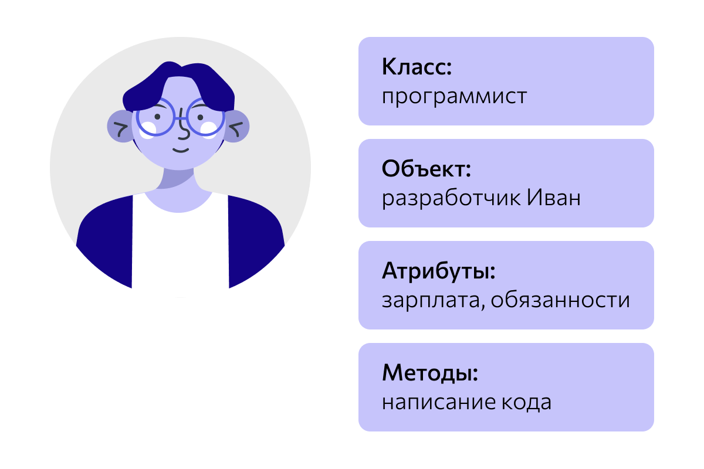
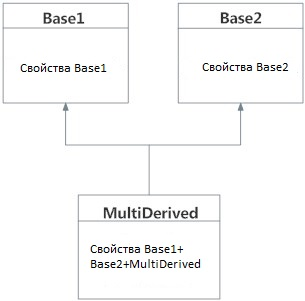

# Объектно-Ориентированное Программирование (ООП) в Python

Python - это мультипарадигмальный язык программирования. Это означает, что он поддерживает разные подходы к программированию.\
Одним из популярных подходов к решению проблемы программирования является возможность создания объектов или использование объектно-ориентированного программирования (ООП)

---
**Объектно-Ориентированное Программирование (ООП)** — это парадигма программирования, которая организует код вокруг объектов, а не действий. В ООП объекты объединяют данные и функции, работающие с этими данными, в единую сущность. Это позволяет создавать более гибкие, расширяемые и поддерживаемые программы.

В Python объектно-ориентированное программирование основано на использовании **классов** и **объектов**.

### 1. **Классы и объекты**

### Класс
Класс — это своего рода шаблон или чертёж для создания объектов. Он описывает, какие атрибуты (свойства) и методы (функции) будут у объектов, созданных на его основе. Класс не является объектом сам по себе, а служит как инструкция для создания этих объектов.
Когда вы создаёте объект из класса, он наследует все атрибуты и методы, описанные в классе. Атрибуты хранят данные, а методы выполняют операции с этими данными.

**Определение класса**:
```python
class Dog:
    def __init__(self, name, breed):
        self.name = name  # Атрибут
        self.breed = breed  # Атрибут
    
    def bark(self):  # Метод
        print(f"{self.name} says Woof!")
```

#### Немного подробнее о конструкторах...

- `__init__`: Это конструктор (или инициализатор), который вызывается при создании нового объекта. Он инициализирует атрибуты объекта.
    - __init __() это встроенная функция класса 
    - Метод __init__ вызывается единожды, и не может быть вызван снова внутри программы
  Метод __init __() вызывается автоматически каждый раз, когда класс используется для создания нового объекта
- `self`: Это ссылка на текущий экземпляр объекта. Все атрибуты и методы класса используются через `self`.

#### Объект
Объект — это конкретный экземпляр класса. Когда вы создаёте объект на основе класса, он наследует все атрибуты и методы этого класса, но при этом может иметь свои собственные уникальные значения для этих атрибутов.

**Создание объектов**:
```python
dog1 = Dog("Buddy", "Golden Retriever")
dog2 = Dog("Max", "Beagle")

dog1.bark()  # Buddy says Woof!
dog2.bark()  # Max says Woof!
```

### 2. **Атрибуты и методы**

- **Атрибуты** — это переменные, которые определены внутри класса и используются для хранения данных, относящихся к конкретному объекту этого класса. Они позволяют объекту содержать информацию, характеризующую его свойства.
Например, у объекта класса "Машина" атрибутами могут быть марка (например, "Toyota"), цвет (например, "красный"), год выпуска (например, 2020), и скорость (например, 150 км/ч).
- **Методы** — это функции, которые определены внутри класса и предназначены для выполнения действий, связанных с объектом. Они могут изменять данные объекта, выполнять вычисления или возвращать информацию о состоянии объекта. Методы позволяют реализовывать логику работы с объектами.
Например, у класса "Машина" метод запустить двигатель() может включать двигатель, метод тормозить() — уменьшать скорость, а метод описание() — возвращать строку с информацией о марке, цвете и годе выпуска автомобиля.

#### Пример с атрибутами и методами:
```python
class Car:
    def __init__(self, brand, model, year):
        self.brand = brand
        self.model = model
        self.year = year
    
    def display_info(self):
        print(f"{self.year} {self.brand} {self.model}")
```

**Создание объекта и вызов метода**:
```python
car = Car("Toyota", "Camry", 2020)
car.display_info()  # 2020 Toyota Camry
```


---
# В Python всё является объектами. 
Это означает, что любая сущность, с которой вы работаете, будь то число, строка, список, функция или даже модуль, представляет собой объект. 

Каждый объект в Python имеет значения (состояние) и методы (действия), поскольку все объекты создаются на основе классов. Класс можно представить как шаблон или чертёж, который определяет, какие данные (атрибуты) и поведение (методы) будет иметь объект, созданный на его основе. 

Например, класс `int` описывает объекты, представляющие целые числа, а класс `list` задаёт структуру для списков и методы для работы с ними, такие как добавление или удаление элементов. 

Классы обеспечивают основу для объектно-ориентированного программирования, позволяя организовать код и создавать сложные структуры данных, которые включают и данные, и функции для их обработки.

---

### 3. Свойства и атрибуты в Python

1. **Свойства объекта**  
   Свойства объекта характеризуют его поведение и состояние. В Python они могут быть реализованы с помощью атрибутов экземпляра или класса.

2. **Атрибут экземпляра** (Динамический атрибут)\
   Атрибут экземпляра — это переменная, принадлежащая конкретному объекту. Она определена для одного экземпляра класса и может быть использована только в контексте этого объекта. Такие атрибуты создаются внутри конструктора `__init__(self, ...)` класса. Это динамическое поле, значение которого может изменяться для каждого экземпляра отдельно. Атрибут экземпляра доступен только в области видимости объекта.

3. **Атрибут класса** (Статический атрибут)\
   Атрибут класса — это переменная, которая принадлежит самому классу, а не отдельным объектам. Все объекты этого класса могут использовать один и тот же атрибут класса. Атрибуты класса определяются вне конструктора `__init__(self, ...)` и называются статическими полями. Эти атрибуты можно использовать без создания объекта, так как они принадлежат классу в целом, а не его экземплярам.

### Примеры атрибутов экземпляра и класса

1. **Атрибут экземпляра**

```python
class Car:
    def __init__(self, brand, model):
        self.brand = brand  # атрибут экземпляра
        self.model = model  # атрибут экземпляра

# Создание объекта
car1 = Car("Tesla", "Model S")
car2 = Car("BMW", "X5")

# Атрибуты экземпляра уникальны для каждого объекта
print(car1.brand)  # Выведет: Tesla
print(car2.brand)  # Выведет: BMW
```

В этом примере `brand` и `model` — это атрибуты экземпляра. Каждый объект (`car1`, `car2`) имеет свои уникальные значения этих атрибутов.

2. **Атрибут класса**

```python
class Car:
    wheels = 4  # атрибут класса, который одинаков для всех экземпляров

    def __init__(self, brand, model):
        self.brand = brand
        self.model = model

# Создание объектов
car1 = Car("Tesla", "Model S")
car2 = Car("BMW", "X5")

# Атрибут класса доступен через класс и экземпляры
print(car1.wheels)  # Выведет: 4
print(car2.wheels)  # Выведет: 4
print(Car.wheels)   # Выведет: 4
```

Здесь `wheels` — это атрибут класса. Он общий для всех объектов этого класса и может быть доступен как через экземпляры, так и через сам класс.

### 4. Управление доступом в объектно-ориентированных языках

В классических объектно-ориентированных языках программирования, таких как C++ и Java, доступ к членам класса контролируется с помощью ключевых слов `public`, `private` и `protected`. Эти ключевые слова помогают реализовать принцип **инкапсуляции**, который ограничивает доступ к данным и методам, позволяя управлять их использованием.
В Python же нет встроенного механизма для жесткого ограничения доступа к переменным или методам экземпляра класса. Вместо этого используется соглашение о префиксе имени переменной или метода с одним или двумя подчеркиваниями, чтобы эмулировать поведение спецификаторов доступа «protected» и «private». По умолчанию все члены класса являются публичными, и могут быть доступны извне.


#### 1. **Private (Приватные члены класса)**

Приватные члены класса (переменные и методы), как правило, не доступны извне класса. Они могут быть использованы только внутри класса. Это позволяет скрыть детали реализации и предотвратить неправильное использование этих данных из внешнего кода. Приватные члены обычно инкапсулируются для обеспечения безопасного взаимодействия с объектом.

**Пример:**

```python
class BankAccount:
    def __init__(self, owner, balance=0):
        self.owner = owner
        self.__balance = balance  # Приватная переменная

    def deposit(self, amount):
        if amount > 0:
            self.__balance += amount
        else:
            print("Сумма должна быть положительной")

    def get_balance(self):
        return self.__balance

account = BankAccount("Alice")
account.deposit(100)
print(account.get_balance())  # Выведет: 100

# Ошибка: Невозможно обратиться к приватной переменной
# print(account.__balance)  # Атрибут 'BankAccount' имеет защищённый доступ
```

Здесь переменная `__balance` — приватная и не может быть доступна извне класса. Доступ к ней обеспечивается через методы `deposit` и `get_balance`.

#### 2. **Public (Публичные члены класса)**

Публичные члены класса (обычно это методы) доступны извне класса. Чтобы вызвать публичный метод, достаточно создать экземпляр класса. Публичные члены являются основным интерфейсом для взаимодействия с объектом.

**Пример:**

```python
class Car:
    def __init__(self, brand, model):
        self.brand = brand
        self.model = model

    def start_engine(self):
        print(f"{self.brand} {self.model} двигатель запущен.")

car = Car("Tesla", "Model 3")
car.start_engine()  # Выведет: Tesla Model 3 двигатель запущен.
```

В этом примере метод `start_engine` является публичным, и его можно вызвать извне, создав объект класса `Car`.

#### 3. **Protected (Защищённые члены класса)**

Защищённые члены класса доступны внутри самого класса и в дочерних классах (классах-наследниках). Защищённый доступ ограничивает использование этих данных извне, но позволяет наследникам работать с ними. Это поддерживает принцип **наследования**, позволяя дочерним классам использовать ресурсы родительского класса.

**Пример:**

```python
class Animal:
    def __init__(self, name):
        self.name = name
        self._health = 100  # Защищённый атрибут

    def get_health(self):
        return self._health

class Dog(Animal):
    def __init__(self, name):
        super().__init__(name)

    def bark(self):
        print(f"{self.name} говорит: Гав!")

    def decrease_health(self, damage):
        self._health -= damage

dog = Dog("Rex")
dog.bark()  # Выведет: Rex говорит: Гав!
dog.decrease_health(10)
print(dog.get_health())  # Выведет: 90

# Ошибка: Невозможно обратиться к защищённому атрибуту извне
# print(dog._health)  # Атрибут '_health' имеет защищённый доступ
```

В этом примере атрибут `_health` является защищённым. Он доступен в классе `Animal` и его дочернем классе `Dog`, но не может быть напрямую изменён извне.


### Деструкторы и удаление атрибутов и объектов в Python

В Python деструкторы и механизмы удаления объектов управляются системой сборщика мусора, которая автоматически удаляет объекты, когда на них больше не существует ссылок. Однако Python также предоставляет механизмы для явного удаления атрибутов и объектов, используя специальные методы и операторы.

#### 5. **Деструкторы в Python**

Деструктор — это метод, который автоматически вызывается при уничтожении объекта. В Python этот метод называется `__del__`. Он выполняется, когда объект перестает быть доступным (например, когда на объект больше не существует ссылок, и он будет уничтожен сборщиком мусора).

**Пример:**

```python
class MyClass:
    def __init__(self, name):
        self.name = name
        print(f"Объект {self.name} создан")

    def __del__(self):
        print(f"Объект {self.name} уничтожен")

# Создание и удаление объекта
obj = MyClass("Test Object")
del obj  # Явный вызов деструктора
```

Вывод:
```
Объект Test Object создан
Объект Test Object уничтожен
```

В этом примере метод `__del__` вызывается, когда объект `obj` удаляется с помощью оператора `del`. Деструктор обычно используется для освобождения ресурсов, таких как закрытие файлов или сетевых соединений.

**Важно**: В Python деструкторы не всегда вызываются сразу после того, как объект выходит из области видимости, поскольку сборщик мусора может освободить память с задержкой.

#### 2. **Удаление атрибутов**

Удаление атрибутов экземпляра класса можно выполнить с помощью функции `del`. Она позволяет удалять как атрибуты объекта, так и сам объект.

**Пример:**

```python
class MyClass:
    def __init__(self, name):
        self.name = name

obj = MyClass("Test Object")
print(obj.name)  # Выведет: Test Object
del obj.name     # Удаление атрибута
# Ошибка: Атрибут 'name' больше не существует
# print(obj.name)  # AttributeError: 'MyClass' object has no attribute 'name'
```

Здесь атрибут `name` удаляется с помощью оператора `del`, и дальнейший доступ к этому атрибуту вызовет ошибку.

#### 3. **Удаление объектов**

Для удаления объекта целиком (удаления всех ссылок на объект) используется оператор `del`. Это не уничтожает объект немедленно, но уменьшает счетчик ссылок на объект. Когда счетчик ссылок достигает нуля, объект будет уничтожен сборщиком мусора.

**Пример:**

```python
class MyClass:
    def __init__(self):
        print("Объект создан")

obj1 = MyClass()
obj2 = obj1  # Создается вторая ссылка на объект

del obj1  # Удаление первой ссылки
# Объект все еще существует, потому что на него есть ссылка в obj2

del obj2  # Удаление второй ссылки
# Теперь объект уничтожен
```

В этом примере объект будет удален только тогда, когда обе ссылки на него (в `obj1` и `obj2`) будут удалены.

#### 4. **Автоматическое удаление: Сборщик мусора**

Python использует сборщик мусора для автоматического управления памятью. Он отслеживает объекты и автоматически удаляет те, которые больше не используются (когда на них нет ссылок). Система сборки мусора Python использует **счетчик ссылок** и **алгоритм обнаружения циклических ссылок**, чтобы своевременно освобождать память.

**Пример:**

```python
import gc

class MyClass:
    def __init__(self):
        print("Объект создан")

obj = MyClass()
del obj  # Явное удаление объекта
gc.collect()  # Принудительный запуск сборщика мусора
```

Хотя объект будет удален с помощью `del`, иногда нужно вручную вызвать сборщик мусора с помощью `gc.collect()`, чтобы убедиться, что неиспользуемые объекты будут уничтожены.

### Итоги

- **Деструктор `__del__`** вызывается, когда объект уничтожается сборщиком мусора.
- **Удаление атрибутов** выполняется с помощью оператора `del`.
- **Удаление объектов** осуществляется с помощью `del`, но объект будет удален только, когда на него больше не будет ссылок.
- **Сборщик мусора** автоматически управляет памятью, но иногда можно вручную запустить сбор мусора с помощью модуля `gc`.


---

## **Декораторы в Python**

**Декораторы** в Python — это функции, которые позволяют изменять или расширять поведение других функций или методов. Они работают как обертки вокруг других функций или методов и могут добавлять дополнительную логику, не изменяя саму функцию. Декораторы в Python часто используются для улучшения читаемости и повторного использования кода, а также для соблюдения принципов инкапсуляции и абстракции.

#### 1. **Что такое декоратор?**

Декоратор — это функция, которая принимает другую функцию в качестве аргумента и возвращает новую функцию, которая обычно расширяет или изменяет поведение исходной функции.

Простой пример декоратора:

```python
def my_decorator(func):
    def wrapper():
        print("Перед вызовом функции.")
        func()  # вызов исходной функции
        print("После вызова функции.")
    return wrapper

@my_decorator
def say_hello():
    print("Привет!")

say_hello()
```

**Вывод:**
```
Перед вызовом функции.
Привет!
После вызова функции.
```

Здесь:
- `my_decorator` — это декоратор, который добавляет поведение до и после выполнения функции `say_hello`.
- `@my_decorator` — это синтаксический сахар, который заменяет `say_hello = my_decorator(say_hello)`.

#### 2. **Декораторы с аргументами**

Если функция, которую мы декорируем, принимает аргументы, декоратор должен учитывать это. Мы можем передать аргументы функции декоратора с помощью дополнительной обертки.

Пример декоратора с аргументами:

```python
def my_decorator(func):
    def wrapper(*args, **kwargs):
        print("Перед вызовом функции с аргументами.")
        result = func(*args, **kwargs)
        print("После вызова функции.")
        return result
    return wrapper

@my_decorator
def greet(name):
    print(f"Привет, {name}!")

greet("Alice")
```

**Вывод:**
```
Перед вызовом функции с аргументами.
Привет, Alice!
После вызова функции.
```

Здесь:
- `wrapper(*args, **kwargs)` позволяет декоратору передавать любые аргументы в исходную функцию.

#### 3. **Декораторы с возвращаемым значением**

Декораторы могут также изменять возвращаемое значение функции.

Пример декоратора, который изменяет результат функции:

```python
def multiply_decorator(func):
    def wrapper(*args, **kwargs):
        result = func(*args, **kwargs)
        return result * 2
    return wrapper

@multiply_decorator
def add(a, b):
    return a + b

print(add(2, 3))  # 10
```

**Вывод:**
```
10
```

Здесь:
- Декоратор `multiply_decorator` умножает результат функции `add` на 2.


#### 4. **Использование `functools.wraps` в декораторах**

Если вы хотите, чтобы ваш декоратор сохранял оригинальное имя и документацию функции, вы должны использовать `functools.wraps`. Это помогает сохранить метаданные исходной функции, такие как её имя, документацию и т. д.

Пример с `functools.wraps`:

```python
from functools import wraps

def my_decorator(func):
    @wraps(func)
    def wrapper(*args, **kwargs):
        print("Выполнение до функции.")
        result = func(*args, **kwargs)
        print("Выполнение после функции.")
        return result
    return wrapper

@my_decorator
def say_hello():
    """Это функция, которая приветствует."""
    print("Привет!")

print(say_hello.__name__)  # say_hello
print(say_hello.__doc__)   # Это функция, которая приветствует.
```

Без использования `@wraps`, функция `say_hello` после декорирования могла бы потерять своё имя и документацию, а использование `@wraps(func)` сохраняет эти метаданные.

### Итоги:
- Декораторы в Python позволяют расширять или изменять поведение функций и методов без изменения их исходного кода.
- Используя `@property` и другие встроенные декораторы, можно контролировать доступ к атрибутам классов.
- Для сохранения метаданных оригинальной функции при использовании декораторов рекомендуется использовать `functools.wraps`.

---

# Принципы ООП

### Абстракция в объектно-ориентированном программировании

**Абстракция** — это процесс создания упрощенной модели объекта, который позволяет сосредоточиться только на его наиболее важных характеристиках, игнорируя менее значимые или нерелевантные детали в определенном контексте. В программировании абстракция помогает упрощать сложные системы, скрывая внутреннюю сложность объектов и оставляя только необходимую информацию для работы с ними.

#### Пример абстракции в реальной жизни:
Когда мы говорим о **ноутбуке**, мы не задумываемся о множестве деталей, таких как материалы корпуса (пластик, металл), его компоненты (жидкокристаллический дисплей, микросхемы и т. д.), или механизмы работы. Мы воспринимаем ноутбук как единый объект с основными функциями, такими как возможность обработки данных и подключения к интернету. Для нас важно, как он работает, а не как устроен внутри. Это и есть пример абстракции — мы игнорируем второстепенные детали и фокусируемся на главном.

#### Зачем нужна абстракция в программировании?
Абстракция позволяет:
- **Снижение сложности**: Изолируя детали реализации, можно сосредоточиться на ключевых аспектах работы объекта или системы.
- **Упрощение разработки**: Разработчики могут работать с объектами или функциями, не заботясь о том, как они реализованы внутри.
- **Повышение читаемости кода**: Скрытие сложной логики и оставление только интерфейса делает код легче для понимания и использования.

#### Пример абстракции в объектно-ориентированном программировании:
Предположим, у нас есть класс, представляющий транспортное средство. В рамках абстракции мы можем скрыть такие детали, как конкретный механизм работы двигателя или устройство подвески, предоставив только основные функции, как движение, остановка и ускорение.

```python
class Vehicle:
    def start_engine(self):
        print("Двигатель запущен")
        
    def stop_engine(self):
        print("Двигатель остановлен")
        
class Car(Vehicle):
    def open_trunk(self):
        print("Крышка багажника открыта")
        
class Bicycle(Vehicle):
    def ring_bell(self):
        print("Звонок прозвонил")

# Использование абстракции
car = Car()
car.start_engine()  # Запуск двигателя
car.open_trunk()    # Открытие багажника

bike = Bicycle()
bike.start_engine()  # Запуск двигателя
bike.ring_bell()     # Звонок велосипеда
```

В данном примере, **Vehicle** является абстракцией для всех транспортных средств, которая скрывает детали реализации. Мы можем работать с объектами **Car** и **Bicycle**, зная только их основные действия (например, запуск двигателя или звонок велосипеда), без необходимости знать, как именно эти действия реализованы.

---

### 1. **Инкапсуляция**

### Принцип инкапсуляции данных

Инкапсуляция — это принцип ООП, который заключается в том, что данные внутри объекта скрыты от внешнего мира и могут быть изменены только через публичные методы. Это позволяет избежать нежелательных изменений в состоянии объекта и контролировать доступ к его данным.

- **Приватные члены** класса обеспечивают скрытие реализации и защиту данных.
- **Публичные члены** предоставляют интерфейс для взаимодействия с объектом.
- **Защищённые члены** доступны для наследников, что поддерживает принцип **наследования**, позволяя дочерним классам работать с данными родительского класса.

Этот подход помогает повысить безопасность, упрощает сопровождение кода и улучшает его организацию.

#### Пример инкапсуляции:
```python
class BankAccount:
    def __init__(self, balance):
        self.__balance = balance  # Приватный атрибут

    def deposit(self, amount):
        if amount > 0:
            self.__balance += amount

    def get_balance(self):
        return self.__balance
```

**Создание объекта и доступ к приватным атрибутам**:
```python
account = BankAccount(1000)
account.deposit(500)
print(account.get_balance())  # 1500
```

Прямой доступ к приватному атрибуту невозможен:
```python
# print(account.__balance)  # Ошибка, нельзя получить доступ к приватному атрибуту
```

### **Getter-ы и Setter-ы в Python**

**Getter** и **Setter** — это методы, которые используются для получения (getter) и установки (setter) значений атрибутов объекта. Они являются частью принципа инкапсуляции в объектно-ориентированном программировании, который позволяет скрыть детали реализации и обеспечивать доступ к данным объекта только через определенные интерфейсы.

В Python вместо явного использования методов для получения и установки атрибутов, часто используются свойства через декораторы `@property`, но можно использовать и традиционные методы.

#### 1. **Getter**

Метод **getter** используется для доступа к значению атрибута объекта. Обычно это публичный метод, который позволяет получить значение защищенного атрибута.

**Пример getter:**

```python
class Person:
    def __init__(self, name, age):
        self._name = name  # Защищенный атрибут
        self._age = age    # Защищенный атрибут

    # Getter для имени
    def get_name(self):
        return self._name

    # Getter для возраста
    def get_age(self):
        return self._age


# Использование getter
person = Person("Alice", 30)
print(person.get_name())  # Alice
print(person.get_age())   # 30
```

В данном примере методы `get_name` и `get_age` предоставляют доступ к защищенным атрибутам `_name` и `_age`.

#### 2. **Setter**

Метод **setter** используется для установки значения атрибута объекта. Это позволяет контролировать, как атрибуты объекта изменяются.

**Пример setter:**

```python
class Person:
    def __init__(self, name, age):
        self._name = name  # Защищенный атрибут
        self._age = age    # Защищенный атрибут

    # Setter для имени
    def set_name(self, name):
        if len(name) > 0:
            self._name = name
        else:
            print("Имя не может быть пустым")

    # Setter для возраста
    def set_age(self, age):
        if age > 0:
            self._age = age
        else:
            print("Возраст должен быть положительным числом")


# Использование setter
person = Person("Alice", 30)
person.set_name("Bob")
person.set_age(25)

print(person.get_name())  # Bob
print(person.get_age())   # 25
```

В этом примере методы `set_name` и `set_age` проверяют, что переданные значения соответствуют определенным условиям, прежде чем установить их.

#### 3. **Использование декораторов для свойств (Property)**

В Python можно использовать декораторы `@property` для создания getter-ов и `@<attribute>.setter` для создания setter-ов. Это позволяет обращаться к атрибутам как к обычным переменным, но с применением логики через методы.

**Пример использования свойств (property):**

```python
class Person:
    def __init__(self, name, age):
        self._name = name
        self._age = age

    # Getter для имени
    @property
    def name(self):
        return self._name

    # Setter для имени
    @name.setter
    def name(self, value):
        if len(value) > 0:
            self._name = value
        else:
            print("Имя не может быть пустым")

    # Getter для возраста
    @property
    def age(self):
        return self._age

    # Setter для возраста
    @age.setter
    def age(self, value):
        if value > 0:
            self._age = value
        else:
            print("Возраст должен быть положительным числом")


# Использование свойств
person = Person("Alice", 30)
print(person.name)  # Alice
person.name = "Bob"  # Установка нового имени
print(person.name)  # Bob

person.age = 25  # Установка нового возраста
print(person.age)  # 25
```

В этом примере:
- `@property` превращает метод в getter, который позволяет получить значение атрибута `name` или `age`, не вызывая метод как функцию.
- `@name.setter` и `@age.setter` позволяют задать значения атрибутов, но с дополнительной проверкой, что их значения удовлетворяют определенным условиям.

#### Преимущества использования `property`:
- Синтаксис удобен и позволяет работать с атрибутами как с обычными переменными, но с дополнительной логикой.
- Это повышает инкапсуляцию, так как позволяет контролировать доступ и изменение атрибутов объекта без раскрытия деталей реализации.

###№ Итоги:
- **Getter** предоставляет доступ к атрибуту объекта.
- **Setter** позволяет устанавливать значения атрибутов с дополнительной логикой.
- В Python можно использовать декораторы `@property` и `@<attribute>.setter`, чтобы упростить работу с getter-ами и setter-ами, сохраняя инкапсуляцию и проверку данных.

---

### Декораторы `@classmethod` и `@staticmethod` в Python

Декораторы `@classmethod` и `@staticmethod` используются для определения методов в классе, которые имеют определенные особенности в плане доступа к объекту и классу. Эти методы помогают гибко работать с атрибутами класса и экземпляра, а также предоставляют способы организации кода, когда метод не зависит от экземпляра класса.

#### 1. **`@classmethod`**
Метод, аннотированный как `@classmethod`, принимает первым аргументом сам класс (обычно его называют `cls`) вместо экземпляра (который передается в обычных методах как `self`).

- **Основная цель:** Методы, помеченные как `@classmethod`, могут быть вызваны как для экземпляра класса, так и для самого класса. Они могут изменять атрибуты класса, но не имеют доступа к атрибутам конкретных экземпляров.

**Пример:**

```python
class MyClass:
    count = 0  # Атрибут класса

    def __init__(self, name):
        self.name = name
        MyClass.count += 1  # Увеличиваем счетчик при каждом создании экземпляра

    @classmethod
    def get_count(cls):
        return cls.count  # Возвращаем количество экземпляров класса

# Создаем несколько объектов
obj1 = MyClass("Alice")
obj2 = MyClass("Bob")

print(MyClass.get_count())  # Использование класса для вызова class method
print(obj1.get_count())     # Использование экземпляра для вызова class method
```

**Вывод:**
```
2
2
```

Здесь метод `get_count` является методом класса, так как принимает `cls` в качестве аргумента и может изменять атрибуты класса (например, `count`).

#### 2. **`@staticmethod`**
Метод, аннотированный как `@staticmethod`, не имеет доступа к атрибутам экземпляра (`self`) или класса (`cls`). Он просто выполняет какую-то задачу, не зависящую от состояния объекта или класса. Такие методы часто используются для утилитарных функций, которые логически принадлежат классу, но не зависят от его состояния.

- **Основная цель:** Статические методы, как правило, не используют параметры `self` или `cls` и могут быть вызваны как для экземпляра класса, так и для самого класса.

**Пример:**

```python
class MyClass:
    @staticmethod
    def greet(name):
        print(f"Привет, {name}!")

# Можно вызвать как для экземпляра, так и для класса
MyClass.greet("Alice")
obj = MyClass("Bob")
obj.greet("Charlie")
```

**Вывод:**
```
Привет, Alice!
Привет, Charlie!
```

Здесь метод `greet` является статическим, так как он не использует ни экземпляр (`self`), ни класс (`cls`), и выполняет простую задачу (выводит приветствие).

#### 3. **Сравнение `@classmethod` и `@staticmethod`:**

- **`@classmethod`:**
  - Работает с классом и его атрибутами.
  - Первый аргумент — `cls`, представляющий класс.
  - Может быть вызван через экземпляр или напрямую через класс.
  
- **`@staticmethod`:**
  - Не работает с классом или экземпляром, и не имеет аргументов `self` или `cls`.
  - Используется для функций, логически связанных с классом, но не использующих его состояние.
  - Может быть вызван через экземпляр или напрямую через класс.

#### Итоги:
- `@classmethod` позволяет методу работать с классом и его атрибутами, в отличие от обычных методов, которые работают с экземпляром.
- `@staticmethod` предоставляет способ создать методы, которые не зависят от состояния ни экземпляра, ни класса.
---


### 2. **Наследование**

Наследование — это механизм объектно-ориентированного программирования, который позволяет создать новый класс на основе уже существующего, используя его характеристики (методы и атрибуты) без необходимости изменять исходный класс.
Это помогает избежать дублирования кода и позволяет переиспользовать функциональность.

- **Производный класс (дочерний класс)** — это класс, который наследует атрибуты и методы от другого класса (родительского).
- **Базовый класс (родительский класс)** — это класс, который предоставляет свои свойства и методы для использования в дочерних классах.

**Пример наследования**:
```python
class Animal:
    def __init__(self, name):
        self.name = name
    
    def speak(self):
        print(f"{self.name} makes a sound")

class Dog(Animal):
    def speak(self):
        print(f"{self.name} says Woof!")
        
class Cat(Animal):
    def speak(self):
        print(f"{self.name} says Meow!")
```

**Использование наследования**:
```python
dog = Dog("Rex")
cat = Cat("Whiskers")

dog.speak()  # Rex says Woof!
cat.speak()  # Whiskers says Meow!
```

Здесь класс `Dog` и `Cat` наследуют метод `speak` от родительского класса `Animal`, но переопределяют его для выполнения специфичных для них действий.

### **Множественное наследование**

Python поддерживает множественное наследование, что позволяет классу наследовать свойства и методы от нескольких классов. Однако, это может привести к проблемам с конфликтующими аттрибутами или методами, которые решаются с помощью методов разрешения конфликтов, таких как **метод разрешения порядка (MRO)**.

#### Пример множественного наследования:
```python
class Animal:
    def speak(self):
        print("Animal speaks")

class Bird:
    def fly(self):
        print("Bird flies")

class Bat(Animal, Bird):
    pass

bat = Bat()
bat.speak()  # Animal speaks
bat.fly()    # Bird flies
```

Здесь класс `Bat` наследует методы от обоих классов `Animal` и `Bird`.

#### 1. **Использование `super()` в наследовании:**

В Python существует встроенная функция `super()`, которая возвращает прокси-объект, позволяющий ссылаться на родительский класс. Она используется для вызова методов родительского класса, что важно при переопределении методов в дочернем классе.

##### **Синтаксис:**
```python
class ParentClass:
    def __init__(self):
        print("Инициализация родительского класса")

    def greet(self):
        print("Привет из родительского класса!")

class SubClass(ParentClass):
    def __init__(self):
        super().__init__()  # Вызов конструктора родительского класса
        print("Инициализация дочернего класса")

    def greet(self):
        super().greet()  # Вызов метода родительского класса
        print("Привет из дочернего класса!")

# Создаем объект дочернего класса
obj = SubClass()
obj.greet()
```

##### **Результат:**
```
Инициализация родительского класса
Инициализация дочернего класса
Привет из родительского класса!
Привет из дочернего класса!
```

В этом примере:

- `SubClass` наследует от `ParentClass`.
- В методе `__init__()` дочернего класса `SubClass` вызывается конструктор родительского класса с помощью `super()`, чтобы не повторять логику инициализации.
- В методе `greet()` дочернего класса также вызывается родительская версия метода через `super()`.

#### 3. **Почему использовать `super()`?**

- **Упрощение вызовов:** Использование `super()` позволяет избежать жесткой привязки к имени родительского класса, что полезно при многократном наследовании.
- **Поддержка многократного наследования:** `super()` корректно работает при использовании множественного наследования, обеспечивая правильный порядок вызова методов в соответствии с MRO (метод разрешения порядка).

### 4. **Множественное наследование и `super()`**:

В Python поддерживается множественное наследование, и `super()` помогает правильно организовать вызовы методов из нескольких базовых классов.



**Пример с множественным наследованием:**

```python
class A:
    def __init__(self):
        print("Инициализация A")

class B(A):
    def __init__(self):
        super().__init__()
        print("Инициализация B")

class C(A):
    def __init__(self):
        super().__init__()
        print("Инициализация C")

class D(B, C):
    def __init__(self):
        super().__init__()
        print("Инициализация D")

# Создаем объект класса D
d = D()
```

**Результат:**
```
Инициализация C
Инициализация B
Инициализация A
Инициализация D
```

Здесь видно, что Python сначала вызывает инициализацию в классе `C`, затем в `B`, а после этого в `A`, что определяется алгоритмом разрешения порядка (MRO).

#### Итоги:
- **Наследование** позволяет создавать новые классы на основе уже существующих, переиспользуя код.
- `super()` используется для вызова методов родительского класса и обеспечивает правильную работу при многократном наследовании.
### 5. **Полиморфизм**

Полиморфизм позволяет использовать одинаковые методы(общий интерфейс) для объектов разных классов, что увеличивает гибкость программ. Методы могут иметь одно имя, но поведение будет зависеть от типа объекта, для которого вызывается этот метод.\

Предположим, что нам нужно раскрасить фигуру. Есть несколько вариантов фигуры (прямоугольник, квадрат, круг). Однако мы могли бы использовать тот же метод, чтобы закрасить любую из этих форм

#### Пример полиморфизма:
```python
class Bird:
    def speak(self):
        print("Tweet")

class Dog:
    def speak(self):
        print("Woof")

animals = [Bird(), Dog()]
for animal in animals:
    animal.speak()  # Выведет "Tweet" и "Woof"
```

Здесь оба класса, `Bird` и `Dog`, имеют метод `speak`, но с разной реализацией. Это пример полиморфизма — один и тот же метод может иметь различные реализации для разных классов.

### 6. **Абстрактные классы**

Мы уже знаем что такое абстракция, так вот в Python абстракция часто реализуется с использованием абстрактных классов.

```python
from abc import ABC, abstractmethod

class Animal(ABC):
    @abstractmethod
    def speak(self):
        pass

class Dog(Animal):
    def speak(self):
        print("Woof!")

class Cat(Animal):
    def speak(self):
        print("Meow!")

# dog = Animal()  # Ошибка, нельзя создать экземпляр абстрактного класса
```

Здесь класс `Animal` является абстрактным, и нельзя создать его экземпляр. Для создания объектов нужно создавать наследников и реализовывать абстрактные методы.


### 8. **Конструкторы и деструкторы**

- **Конструктор** — это метод, который вызывается при создании объекта. В Python это метод `__init__`.
- **Деструктор** — это метод, который вызывается при удалении объекта. В Python это метод `__del__`.

**Пример с конструктором и деструктором**:
```python
class MyClass:
    def __init__(self):
        print("Object created")
    
    def __del__(self):
        print("Object destroyed")

obj = MyClass()  # Выведет "Object created"
del obj  # Выведет "Object destroyed"
```
### Все классы в Python наследуются от `object`

С версии Python 3 все классы являются **нового стиля**, так как они неявно наследуются от общего базового класса `object`. Это делает их частью единой иерархии, что упрощает работу с классами и их методами.

#### Что это значит:

1. **Неявное наследование:**
   - Если вы создаете класс без явного указания базового класса, Python автоматически наследует его от `object`.

   **Пример:**
   ```python
   class MyClass:
       pass
   ```

   Этот класс эквивалентен:
   ```python
   class MyClass(object):
       pass
   ```

2. **Методы из класса `object`(Магические методы):**
   Классы автоматически наследуют методы базового класса `object`, такие как:
   - `__str__()` — для получения строкового представления объекта.
   - `__repr__()` — для получения "официального" строкового представления объекта.
   - `__eq__()` — для сравнения объектов.
   - `__hash__()` — для получения хэш-значения объекта.
   - `__init__()` — базовый конструктор.
   - `__del__()` — базовый деструктор.
   - И другие.

#### Примеры магических методов:

1. **`__init__(self, ...)`**  
   Это конструктор класса. Он вызывается при создании нового экземпляра класса, и его задача — инициализировать атрибуты объекта.

   **Пример:**
   ```python
   class Person:
       def __init__(self, name, age):
           self.name = name
           self.age = age
       
   person1 = Person("Alice", 30)  # __init__ вызывается при создании объекта
   ```

2. **`__str__(self)`**  
   Этот метод вызывается, когда используется функция `str()` или при выводе объекта с помощью `print()`. Он должен возвращать строковое представление объекта.

   **Пример:**
   ```python
   class Person:
       def __init__(self, name, age):
           self.name = name
           self.age = age

       def __str__(self):
           return f"{self.name}, {self.age} years old"

   person1 = Person("Alice", 30)
   print(person1)  # Выведет: Alice, 30 years old
   ```

3. **`__repr__(self)`**  
   Этот метод вызывается при использовании функции `repr()` или когда объект выводится в консоль в интерактивной среде (например, в Python Shell). Он должен возвращать строковое представление объекта, которое будет полезно для отладки.

   **Пример:**
   ```python
   class Person:
       def __init__(self, name, age):
           self.name = name
           self.age = age

       def __repr__(self):
           return f"Person('{self.name}', {self.age})"

   person1 = Person("Alice", 30)
   print(repr(person1))  # Выведет: Person('Alice', 30)
   ```

4. **`__add__(self, other)`**  
   Этот метод позволяет переопределить операцию сложения (`+`) для объектов класса. Он вызывается, когда два объекта складываются.

   **Пример:**
   ```python
   class Point:
       def __init__(self, x, y):
           self.x = x
           self.y = y

       def __add__(self, other):
           return Point(self.x + other.x, self.y + other.y)

   point1 = Point(1, 2)
   point2 = Point(3, 4)
   result = point1 + point2  # Вызывает __add__
   print(result.x, result.y)  # Выведет: 4 6
   ```

5. **`__eq__(self, other)`**  
   Этот метод позволяет переопределить операцию сравнения на равенство (`==`) для объектов класса.

   **Пример:**
   ```python
   class Person:
       def __init__(self, name, age):
           self.name = name
           self.age = age

       def __eq__(self, other):
           return self.name == other.name and self.age == other.age

   person1 = Person("Alice", 30)
   person2 = Person("Alice", 30)
   print(person1 == person2)  # Выведет: True
   ```

### Функция как объект в Python

В Python функции являются объектами первого класса, что означает, что их можно:
- Присваивать переменным.
- Передавать в другие функции в качестве аргументов.
- Возвращать из других функций.
- Сохранять в структурах данных, таких как списки или словари.

#### Основные характеристики функций как объектов:

1. **Функция может быть присвоена переменной:**
   ```python
   def greet(name):
       return f"Hello, {name}!"

   say_hello = greet  # Присваиваем функцию переменной
   print(say_hello("Alice"))  # Вывод: Hello, Alice!
   ```

2. **Функция может быть передана как аргумент другой функции:**
   Это позволяет создавать гибкие конструкции, такие как функции высшего порядка.

   **Пример:**
   ```python
   def apply_function(func, value):
       return func(value)

   def square(x):
       return x ** 2

   print(apply_function(square, 5))  # Вывод: 25
   ```

3. **Функция может быть возвращена из другой функции:**
   ```python
   def multiplier(factor):
       def multiply_by(value):
           return value * factor
       return multiply_by

   double = multiplier(2)
   print(double(10))  # Вывод: 20
   print(multiplier(2)(10))
   ```

4. **Функции могут быть использованы в структурах данных:**
   ```python
   def add(x, y):
       return x + y

   def subtract(x, y):
       return x - y

   operations = {
       "add": add,
       "subtract": subtract
   }

   print(operations["add"](10, 5))       # Вывод: 15
   print(operations["subtract"](10, 5)) # Вывод: 5
   ```

#### Функция имеет метод `__call__()`
Функция в Python — это объект, который имеет специальный метод `__call__()`. Это позволяет вызывать объекты-функции, как если бы они были обычными функциями.

**Пример:**
```python
def example_function(x):
    return x * 2

print(example_function.__call__(10))  # Эквивалент вызову example_function(10), вывод: 20
```

#### Классы с методом `__call__`
Объекты классов с методом `__call__` также можно вызывать, как функции.

**Пример:**
```python
class Adder:
    def __init__(self, value):
        self.value = value

    def __call__(self, other):
        return self.value + other

add_five = Adder(5)
print(add_five(10))  # Вывод: 15
```

---

## Определение классов в модулях и их подключение

#### 1. **Что такое модуль в Python?**
Модуль — это файл с расширением `.py`, который содержит определения функций, классов, переменных или исполняемый код. Он позволяет организовать код в логические блоки и облегчает его повторное использование.

#### 2. **Создание класса в модуле**
Класс можно определить в отдельном модуле, чтобы его можно было подключать и использовать в других частях программы.

**Пример:**

Создадим модуль `shapes.py` с определением класса `Rectangle`:

```python
# shapes.py
class Rectangle:
    def __init__(self, width, height):
        self.width = width
        self.height = height

    def area(self):
        return self.width * self.height

    def perimeter(self):
        return 2 * (self.width + self.height)
```

#### 3. **Подключение модуля**

Для использования класса из модуля необходимо подключить модуль с помощью инструкции `import` или `from ... import`.

##### 3.1. **Подключение всего модуля**

```python
import shapes

rect = shapes.Rectangle(10, 5)
print(f"Площадь: {rect.area()}")        # Вывод: Площадь: 50
print(f"Периметр: {rect.perimeter()}")  # Вывод: Периметр: 30
```

##### 3.2. **Подключение конкретного класса**

```python
from shapes import Rectangle

rect = Rectangle(8, 4)
print(f"Площадь: {rect.area()}")        # Вывод: Площадь: 32
print(f"Периметр: {rect.perimeter()}")  # Вывод: Периметр: 24
```

##### 3.3. **Импорт с псевдонимом**

```python
from shapes import Rectangle as Rect

rect = Rect(6, 3)
print(f"Площадь: {rect.area()}")        # Вывод: Площадь: 18
print(f"Периметр: {rect.perimeter()}")  # Вывод: Периметр: 18
```

##### 3.4. **Импорт всего содержимого модуля (не рекомендуется)**

```python
from shapes import *

rect = Rectangle(7, 2)
print(f"Площадь: {rect.area()}")        # Вывод: Площадь: 14
print(f"Периметр: {rect.perimeter()}")  # Вывод: Периметр: 18
```

> **Примечание:** Использование `from module import *` не рекомендуется, так как это может привести к конфликту имен.

#### 4. **Организация модулей**
Для больших проектов модули можно объединять в пакеты. Пакет — это директория, содержащая модули, и файл `__init__.py` (может быть пустым).

**Пример структуры:**
```
project/
│
├── shapes/
│   ├── __init__.py
│   ├── rectangle.py
│   ├── circle.py
│
├── main.py
```

**Содержимое `rectangle.py`:**
```python
class Rectangle:
    def __init__(self, width, height):
        self.width = width
        self.height = height

    def area(self):
        return self.width * self.height
```

**Содержимое `circle.py`:**
```python
import math

class Circle:
    def __init__(self, radius):
        self.radius = radius

    def area(self):
        return math.pi * (self.radius ** 2)
```

**Подключение модулей в `main.py`:**
```python
from shapes.rectangle import Rectangle
from shapes.circle import Circle

rect = Rectangle(10, 5)
print(f"Площадь прямоугольника: {rect.area()}")  # Вывод: Площадь прямоугольника: 50

circle = Circle(7)
print(f"Площадь круга: {circle.area()}")         # Вывод: Площадь круга: 153.93804002589985
```

#### 5. **Работа с путями модулей**
Если модуль находится не в текущей директории, можно использовать:
- Настройку переменной `PYTHONPATH`.
- Добавление пути вручную:
```python
import sys
sys.path.append('/path/to/directory')
from shapes import Rectangle
```

### 9. **Заключение**

Объектно-ориентированное программирование в Python предоставляет мощные инструменты для создания чистого и поддерживаемого кода. Концепции ООП, такие как классы, объекты, инкапсуляция, наследование, полиморфизм и абстракция, позволяют эффективно решать задачи, создавать гибкие и расширяемые программы. Python, с его поддержкой этих принципов, является отличным языком для реализации ООП.